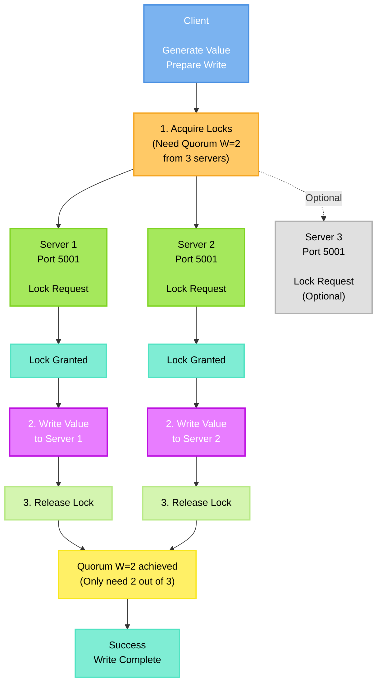
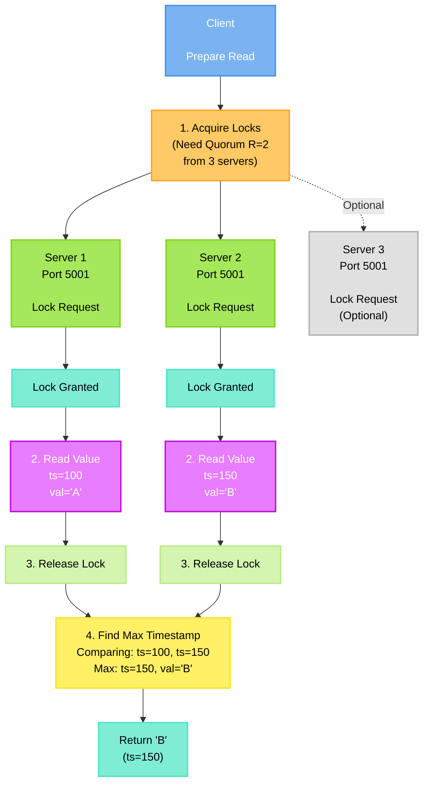
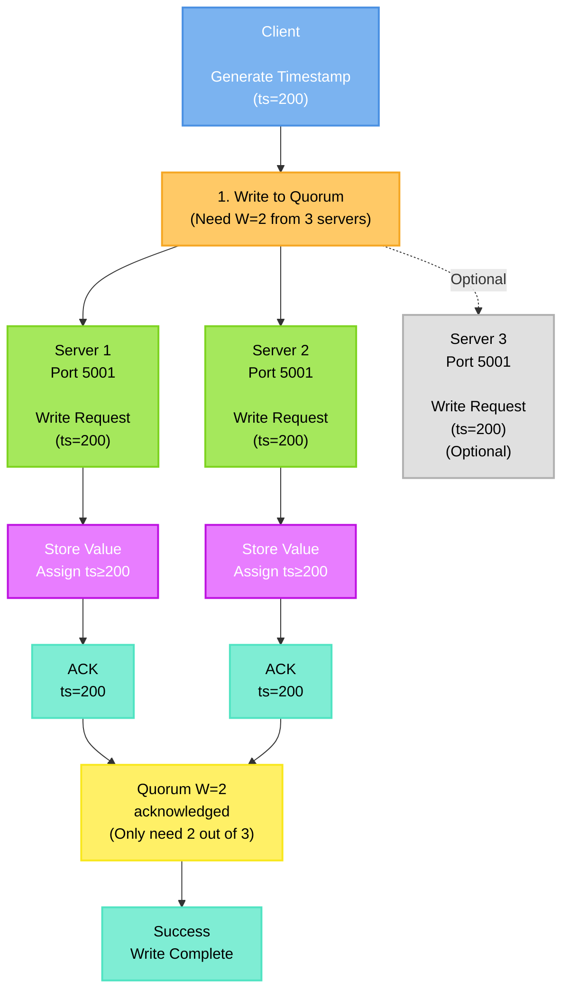
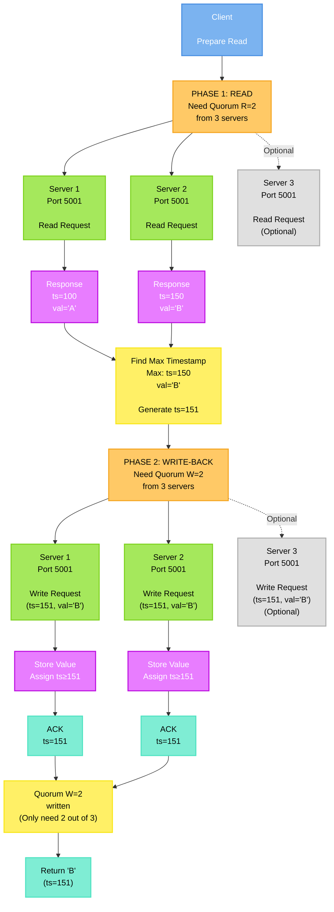

# Protocol Design and Implementation

This document describes the design and implementation of the two replication protocols used in this distributed key-value store: the **Blocking Protocol** and the **ABD Protocol**.

## Blocking Protocol

### Overview

The Blocking Protocol uses **per-key locks** to coordinate access to the key-value store. Clients must acquire locks before performing read or write operations, ensuring exclusive access to keys during operations.

### Key Characteristics

- **Lock-based coordination**: Each key has an associated lock
- **May block**: Clients can block waiting for locks held by other clients
- **Client failure impact**: If a client crashes while holding a lock, other clients may be blocked until the lock times out (30 seconds)
- **Linearizable**: All operations appear to execute atomically in some global order
- **Quorum-based**: Uses read quorum (R) and write quorum (W) for replication

### Algorithm Flow

#### Write Operation (3 Servers, Quorum W=2)

**Steps:**
1. **Acquire Locks**: Client requests locks from all servers. Needs write quorum (W) locks to proceed.
2. **Write Value**: Once locks are acquired, write the value to all locked servers.
3. **Release Locks**: Release all acquired locks.

#### Read Operation (3 Servers, Quorum R=2)

**Steps:**
1. **Acquire Locks**: Client requests locks from all servers. Needs read quorum (R) locks.
2. **Read Values**: Read values and timestamps from all locked servers.
3. **Find Maximum**: Select the value with the highest timestamp.
4. **Release Locks**: Release all acquired locks.

### Lock Management

- **Lock Timeout**: Locks expire after 30 seconds of inactivity
- **Re-entrant**: Same client can acquire the same lock multiple times
- **Overtaking**: If a lock times out, another client can acquire it
- **Per-Key**: Each key has its own independent lock

### Implementation Details

**Server-Side:**
- Maintains a lock table: `std::map<std::string, LockEntry>`
- Each `LockEntry` tracks: owner client ID, acquisition time
- Lock acquisition checks: unlocked, timed out, or same client
- Read/Write operations verify lock ownership

**Client-Side:**
- Requests locks from all servers in parallel
- Waits for quorum (R or W) locks before proceeding
- Releases locks after operation completes
- Handles lock acquisition failures gracefully

### Disadvantages

- **May Block**: Clients can wait indefinitely for locks
- **Client Failure Impact**: Crashed clients can block others for up to 30 seconds
- **Lower Availability**: Lock contention reduces system throughput
- **Deadlock Potential**: Multiple keys can lead to deadlocks (mitigated by timeouts)

---

## ABD Protocol

### Overview

The ABD Protocol is a **non-blocking, wait-free** replication protocol that uses **quorum-based reads and writes** with **timestamp ordering** to achieve linearizability without locks.

### Key Characteristics

- **Non-blocking**: Clients never block waiting for slow or failed servers
- **Wait-free**: Operations complete as soon as quorum is achieved
- **Quorum-based**: Uses read quorum (R) and write quorum (W)
- **Timestamp ordering**: Uses logical timestamps to order operations
- **Linearizable**: All operations appear to execute atomically
- **Resilient to client failures**: Client crashes don't affect other clients

### Algorithm Flow

#### Write Operation (3 Servers, Quorum W=2)

**Steps:**
1. **Generate Timestamp**: Client generates a unique timestamp (monotonically increasing)
2. **Write to Quorum**: Send write request to all servers, wait for write quorum (W) acknowledgments
3. **Complete**: Operation succeeds once W servers acknowledge

#### Read Operation (Two-Phase, 3 Servers, R=2, W=2)

**Steps:**
1. **Phase 1 - Read from Quorum**: 
   - Send read requests to all servers
   - Collect responses from read quorum (R) servers
   - Each response contains: value, timestamp
   
2. **Find Maximum Timestamp**:
   - Select the value with the highest timestamp
   - This ensures we get the most recent value
   
3. **Phase 2 - Write-Back**:
   - Write the maximum value back to write quorum (W) servers
   - Use a timestamp greater than the maximum seen
   - This ensures all servers converge to the latest value

The two-phase read is necessary because:
- **Phase 1** may return stale values from some servers
- **Phase 2** propagates the latest value to all servers
- This ensures **linearizability**: all subsequent reads see at least this value

### Timestamp Management

- **Client Timestamps**: Each client maintains a logical clock
- **Monotonicity**: Client timestamps always increase
- **Server Timestamps**: Servers assign timestamps ≥ client timestamps
- **Ordering**: Operations are ordered by their timestamps

### Implementation Details

**Server-Side:**
- Maintains key-value store: `std::map<std::string, ValueEntry>`
- Each `ValueEntry` contains: value, timestamp
- Read returns current value and timestamp
- Write accepts value and client timestamp, assigns server timestamp ≥ client timestamp

**Client-Side:**
- Maintains logical clock (monotonically increasing)
- Read: Two-phase (read quorum → find max → write-back to write quorum)
- Write: Single-phase (write to write quorum)
- Never blocks: Proceeds as soon as quorum is achieved

### Disadvantages

- **Read Overhead**: Two-phase reads (read + write-back) are more expensive
- **Network Messages**: More RPC calls per read operation
- **Complexity**: More complex than simple locking

---

## Implementation Details

### Quorum Configuration

For **N servers**, quorum sizes must satisfy:
- **R + W > N**: Ensures read and write quorums overlap (guarantees consistency)
- **W > N/2**: Ensures write quorum is majority (prevents split-brain)

**Common configurations:**
- **3 servers**: R=2, W=2 (can tolerate 1 failure)
- **5 servers**: R=3, W=3 (can tolerate 2 failures)

### Consistency Guarantees

Both protocols guarantee **linearizability**:
- All operations appear to execute atomically
- There exists a global ordering of all operations
- Each read returns the value written by the most recent write in that ordering

### Performance Characteristics

**Blocking Protocol:**
- **Read**: Lock acquisition + Read + Lock release
- **Write**: Lock acquisition + Write + Lock release
- **Latency**: Higher due to lock coordination
- **Throughput**: Lower due to lock contention

**ABD Protocol:**
- **Read**: Two-phase (read quorum + write-back to write quorum)
- **Write**: Single-phase (write to write quorum)
- **Latency**: Lower for writes, higher for reads (due to write-back)
- **Throughput**: Higher due to non-blocking nature

---

## Summary

Both protocols provide linearizability but make different trade-offs:
- **Blocking Protocol**: Simpler, but may block and is vulnerable to client failures
- **ABD Protocol**: More complex, but non-blocking and resilient to client failures

